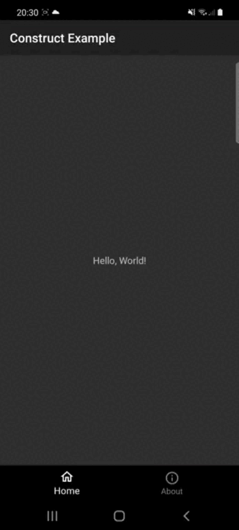

# Construkt
The main goal of this project is to explore the abilities of **Kotlin** for making DSL of regular Views.
> Just playground. Not for prod.
## How it looks like
```kotlin
class AppActivity : AppCompatActivity() {
    private val resId = MutableStateFlow(android.R.drawable.btn_star)
    private val text = MutableStateFlow("Hello, World")

    override fun onCreate(savedInstanceState: Bundle?) {
        super.onCreate(savedInstanceState)
        setContent {
            linearLayout(layoutParams().maxSize()) {
                orientation(LinearLayout.VERTICAL)

                imageView(layoutParams().wrapContentSize()) {
                    imageResource(resId)
                    gravity(Gravity.CENTER)
                }

                textView(layoutParams().wrapContentSize()) {
                    text(text)
                }
            }
        }


        lifecycleScope.launch {
            delay(3000L)
            text.value = "Bye, world!"
            resId.value = android.R.drawable.btn_plus
        }
    }
}
```

|  |
|---------------------------------------|

### Generation

Every view except of base interfaces will be generated. So, there is provided an api with ksp to generate such DSL.
Using the `@ViewDSL` annotation, library will generate interface, implementation for interface (to show only api for end
user), function that will automatically add view into view hierarchy and extensions.

##### Example:
```kotlin
@ViewDSL
typealias TextView = android.widget.TextView
```

Generates:

```kotlin
interface TextView {
    fun text(text: String)
    fun textSize(textSize: Int)
    ...
}

fun ViewGroup.textView(layoutParams: LayoutParams? = null, block: TextView.() -> Unit) {
    addView(TextViewImpl().apply(block))
}

fun ViewGroup.textView(layoutParams: State<LayoutParams>, block: TextView.() -> Unit) {
    addView(TextViewImpl().apply(block))
}

fun TextView.text(text: State<String>) {
    lifecycleOwner.lifecycleScope.launch {
        text.collect { text(it) }
    }
}

fun TextView.textSize(textSize: State<Int>) {
    lifecycleOwner.lifecycleScope.launch {
        textSize.collect { textSize(it) }
    }
}
```
